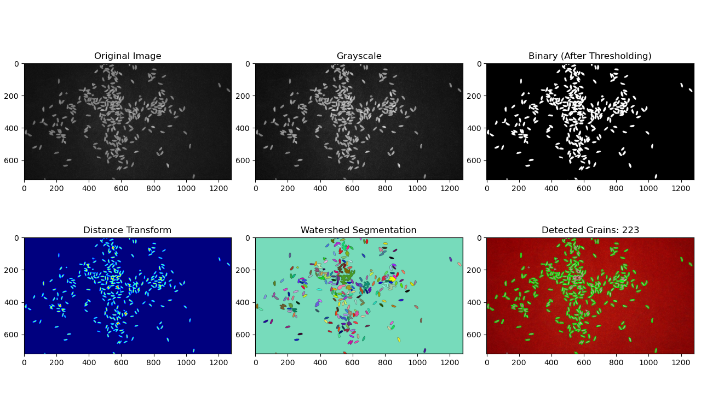

# Raspberry Pi Image Processing System

A image processing application for rice quality analysis using Raspberry Pi Camera Module. This project detects and counts rice grains, stones, and husk in real-time captured images.

## Features

- Live video stream from Raspberry Pi Camera
- Image capture and storage
- Automated detection and counting of:
  - Full rice grains
  - Broken rice grains
  - Stones
  - Husk
- Visual overlay of detected objects with color-coded masks
- REST API for image processing
- Web interface for capturing and analyzing images

## Hardware Requirements

- Raspberry Pi (4 recommended)
- Raspberry Pi Camera Module 3 (Sony IMX708 12.3MP HDR, built-in phase-detect autofocus actuator)
- MicroSD card with Raspberry Pi OS
- Power supply and peripherals

## Software Dependencies

- Python 3.10+
- Flask
- OpenCV (cv2)
- Picamera2
- NumPy
- PIL (Python Imaging Library)
- Matplotlib (for testing)

## Setup Instructions

1. **Clone the Repository**
   ```bash
   git clone https://github.com/yourusername/raspberry-pi-rice-analyzer.git
   cd raspberry-pi-rice-analyzer
   ```

2. **Install Python Dependencies**
   ```bash
   pip install opencv-python picamera2 numpy matplotlib libcamera
   ```

3. **Run the Application**
   ```bash
   python app.py
   ```

4. **Access the Web Interface**
   - Open a web browser and navigate to `http://<raspberry-pi-ip>:5001`
   - Default port is 5001

## Project Working Highlights


*The responsive web interface showing live camera feed and analysis controls*


*Hardware setup with Raspberry Pi 4 and Camera Module 3*


*Results*

## Usage

1. **Live Video Feed**
   - View the live camera feed on the main page

2. **Capture Image**
   - Click the "Capture" button to take a photo
   - The captured image will be displayed below the video feed

3. **Analyze Image**
   - Click "Analyze" to process the captured image
   - Results will be displayed with color-coded overlays:
     - Green: Full rice grains
     - Blue: Broken rice grains
     - Yellow: Stones
     - Pink: Husk

4. **Retake Image**
   - Click "Retake" to capture a new image

## Project Structure

```
raspberry-pi-image-processing/
├── app.py                  # Main Flask application
├── camera.py               # Camera module implementation
├── process_image.py        # Image processing functions
├── static/                 # Static files
│   ├── uploads/            # User uploaded images
│   ├── captured/           # Captured images
│   ├── processed/          # Processed images
│   ├── images/             # Documentation images
│   ├── bootstrap.bundle.js # Client side bootstrap
│   ├── bootstrap.css       # Client side bootstrap
│   └── script.js           # Client-side JavaScript
├── templates/              # HTML templates
│   └── index.html          # Main interface
├── tests/                  # Test files
│   ├── test_processing.py  # Image processing tests
│   └── test_api.py         # API endpoint tests
└── algo_testing.py         # Testing for algorithm
```

## Image Processing Functions

1. **Rice Grain Detection**
   - Uses watershed algorithm for segmentation
   - Classifies grains as full or broken based on shape and size

2. **Stone Detection**
   - Uses HSV color filtering
   - Validates stone shape using aspect ratio analysis

3. **Husk Detection**
   - Uses HSV color filtering
   - Validates husk shape using aspect ratio analysis


## API Endpoints

- **GET /video_feed** - Live video stream
- **POST /capture** - Capture image from camera
- **POST /process_image** - Process image for object detection

## Contributors

- **Aaditya Raj** - *Hardware Integration, IoT Control, Raspberry Pi Setup, Flask Backend Development, Project Management, Team Lead* - [Aaditya](https://github.com/sahay-aaditya-raj)
- **Piyush Kheria** - *Rice Segregation and Classification (Broken vs. Full Grain)* - [Shriyansh](https://github.com/alexj)
- **Shriyansh Agrawal** - *Husk and Stone Detection using Image Processing Techniques* - [Piyush](https://github.com/johnsmith)


